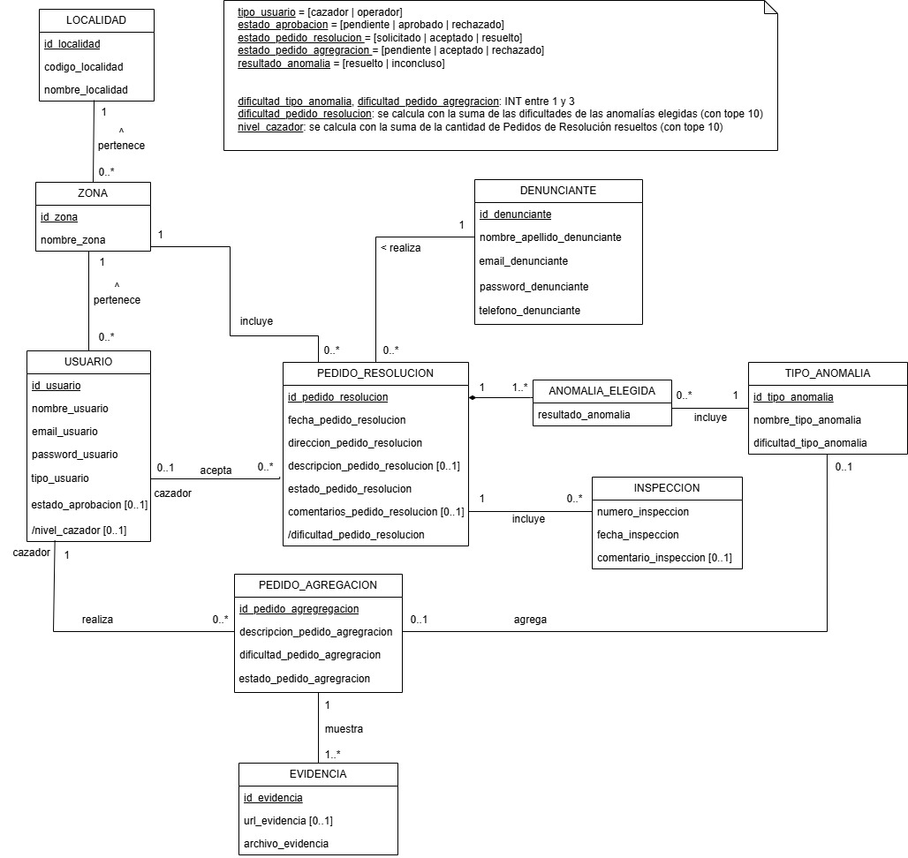

# Propuesta TP DSW

## Grupo

### Integrantes

- 53082 - Tomasino, Alvaro
- 52058 - Aronson, Melina
- 53227 - Aguilera, Tomas

### Repositorios

- [frontend app](https://github.com/tomasinoalvaro48/DSWTP_FrontEnd)
- [backend app](https://github.com/tomasinoalvaro48/DSWTP_BackEnd)

## Tema

### Descripción

#### Resolución de anomalías

En el país, están ocurriendo Anomalías producidas por Fantasmas. Para solucionarlo, se crea un sistema capaz de asignar Avistamientos de Anomalías a Cazadores. Estos Avistamientos son cargados al sistema por un Denunciante, que se registra y genera un Pedido de Resolución, donde detalla la/s Anomalía/s y el lugar del avistamiento. Luego, el Cazador acepta un Pedido de Resolución, según su localidad y su zona y, una vez resuelto, detalla su información.

### Modelo

[Link del modelo (Draw.io)](https://app.diagrams.net/#G1-IVL3tP7jw7QF192Rc02GROQfhCnMEic#%7B%22pageId%22%3A%22ytz_YsIWZ9DYHRH7kDpo%22%7D)

## Alcance Funcional

### Alcance Mínimo

Regularidad:
|Req|Detalle|
|:-|:-|
|CRUD simple|1. CRUD Tipo de Anomalía 2. CRUD Localidad 3. CRUD Denunciante|
|CRUD dependiente|1. CRUD Zona {depende de} CRUD Localidad 2. CRUD Usuario {depende de} CRUD Zona|
|Listado + detalle| 1. Listado de Pedidos de Resolución filtrado por su dificultad y/o localidad, muestra localidad, zona, dificultad y fecha del pedido => detalle CRUD Pedido de Resolución  2. Listado de Pedidos de Agregación filtrado por su estado y/o dificultad, muestra descripción, dificultad y estado del pedido => detalle CRUD Pedidos de Agregación|
|CUU/Epic|1. Generar Pedido de Resolución 2. Generar Pedido de Agregación de Anomalía|

Adicionales para Aprobación:
|Req|Detalle|
|:-|:-|
|CUU/Epic|1. Registrar Inspección|

### Alcance Adicional Voluntario
|Req|Detalle|
|:-|:-|
|CUU/Epic|1. Tomar Pedido de Resolución 2. Aceptar/Rechazar Pedido de Agregación de Anomalía 3. Aprobar cuenta de nuevo cazador 4. Finalizar Pedido de Resolución|
|Otros|1. Subida de archivos como evidencia de un pedido de agregación de anomalía|
